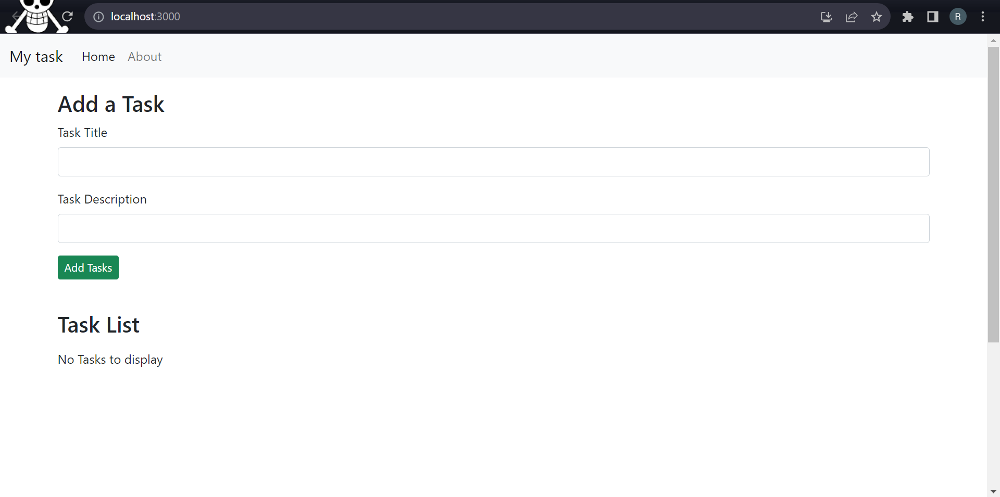

# Task Management App



## Build Setup

``` bash
# install dependencies
npm install react-router-dom@5.2.0

# serve at localhost:3000
npm start
```

## Specific Branch

If you want to checkout a certain branch:

`git branch -a` to list all the branches.

`git checkout 01-basics` (or any branch) to check it out.

